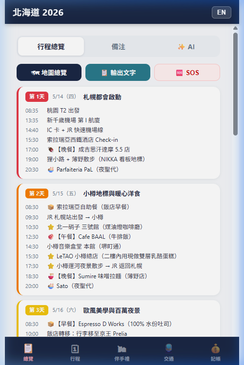
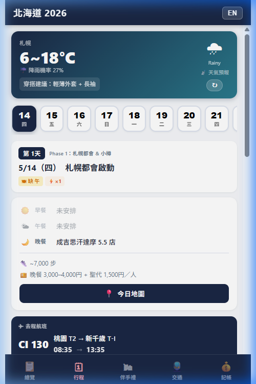
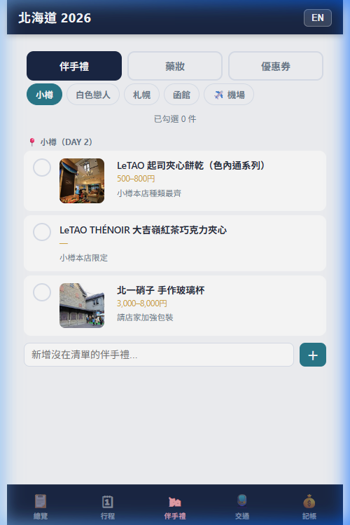
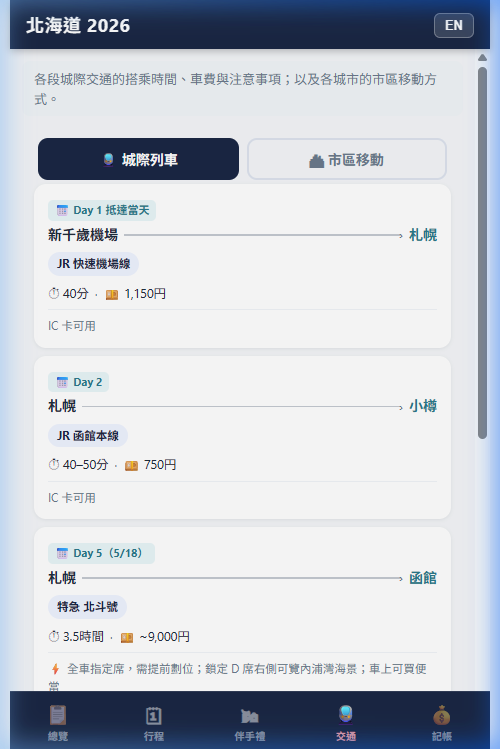

# 🗾 Hokkaido 2026 — Travel Companion PWA

> **一個完全離線可用的旅遊行程管理 PWA**，專為多日自由行設計。  
> 可安裝至手機桌面，無需 App Store，即開即用。

<p align="center">
  
  
  
  
</p>

---

## 📑 目錄

- [功能總覽](#-功能總覽)
- [技術架構](#-技術架構)
- [檔案結構](#-檔案結構)
- [資料流與狀態管理](#-資料流與狀態管理)
- [五大頁面深度解析](#-五大頁面深度解析)
- [核心機制詳解](#-核心機制詳解)
- [部署方式](#-部署方式)
- [客製化指南（萃取為通用模板）](#-客製化指南萃取為通用模板)

---

## ✨ 功能總覽

| 功能模組 | 說明 | 離線可用 |
|---------|------|:-------:|
| 📋 **行程總覽** | 9 天行程一覽、快速跳轉、全程地圖、文字匯出 | ✅ |
| 🗓 **每日行程** | 時間軸卡片、天氣預報、衝突偵測、拖曳排序、CRUD 編輯 | ✅ |
| 🗺 **互動地圖** | Leaflet 地圖、每日路線、全程總覽、Google Maps 導航 | ❌ 需網路 |
| ✅ **清單** | 行前準備勾選（分類）、伴手禮 / 藥妝清單、離線優惠券圖片 | ✅ |
| 🚆 **交通速查** | 城際 JR 列車、市區移動方式、IC 卡 Q&A | ✅ |
| 💰 **消費記帳** | 手動記帳、收據 AI 掃描（Gemini Vision）、JPY↔TWD 匯率 | 部分 |
| ✨ **AI 旅遊助理** | Gemini 驅動，具備行程 context 的即時問答 | ❌ 需網路 |
| 🆘 **緊急資訊** | 一鍵撥打緊急電話、日文旅遊短句手冊 | ✅ |
| 🌐 **雙語切換** | 繁體中文 / English 即時切換 | ✅ |

---

## 🏗 技術架構

### 架構概覽圖

```
┌─────────────────────────────────────────────────────┐
│                   index.html                         │
│  ┌──────────┐ ┌──────────┐ ┌──────────┐ ┌────────┐ │
│  │ Overview │ │Itinerary │ │Souvenirs │ │  ...   │ │
│  │  Page    │ │  Page    │ │  Page    │ │ Pages  │ │
│  └────┬─────┘ └────┬─────┘ └────┬─────┘ └────┬───┘ │
│       └─────────┬──┴───────────┘              │     │
│                 ▼                             │     │
│  ┌──────────────────────────────────────┐     │     │
│  │           js/app.js (主邏輯)          │◄────┘     │
│  │  render* / fetch* / edit* / AI*      │           │
│  └──────┬──────────┬──────────┬─────────┘           │
│         ▼          ▼          ▼                      │
│  ┌──────────┐ ┌─────────┐ ┌──────────┐              │
│  │ js/data  │ │js/state │ │js/impact │              │
│  │  .js     │ │  .js    │ │  .js     │              │
│  │(靜態資料) │ │(狀態層) │ │(衝突偵測)│              │
│  └──────────┘ └────┬────┘ └──────────┘              │
│                    ▼                                 │
│             localStorage                             │
└────────────────────┬────────────────────────────────┘
                     │
        ┌────────────┼────────────┐
        ▼            ▼            ▼
   ┌─────────┐ ┌──────────┐ ┌──────────┐
   │ sw.js   │ │ External │ │ Gemini   │
   │ Service │ │   APIs   │ │ Worker   │
   │ Worker  │ │ Weather  │ │ Proxy    │
   │(離線快取)│ │ OSRM     │ │(AI/OCR) │
   └─────────┘ └──────────┘ └──────────┘
```

### 技術棧

| 層級 | 技術 | 用途 |
|-----|------|------|
| UI | 純 HTML + Vanilla JS + CSS | 零框架，極簡部署 |
| 地圖 | Leaflet 1.9.4 | 互動式地圖與路線繪製 |
| 拖曳 | SortableJS 1.15.2 | 行程項目拖曳排序 |
| 離線 | Service Worker (Cache First) | PWA 離線快取策略 |
| 天氣 | Open-Meteo API / wttr.in | 預報 + 即時天氣 |
| 路線 | OSRM (Project OSRM) | 景點間車程估算 |
| AI | Gemini 2.5 Flash (via CF Worker) | 旅遊問答 + 收據辨識 |
| 匯率 | open.er-api.com | JPY → TWD 即時匯率 |
| 部署 | GitHub Pages | 靜態託管 + HTTPS |

---

## 📁 檔案結構

```
hokkaido-pwa/
├── index.html          # 唯一 HTML 入口（5 個 page section + 6 個 modal）
├── manifest.json       # PWA 清單（名稱、圖標、啟動路徑）
├── sw.js               # Service Worker — 離線快取策略
├── robots.txt
├── css/
│   └── style.css       # 全站樣式（68KB，含深色主題 + 動畫）
├── js/
│   ├── data.js         # 📦 核心資料層：行程、伴手禮、交通、SOS、日文短句
│   ├── state.js        # 🔄 狀態管理：localStorage CRUD + immutable update
│   ├── impact.js       # ⚡ 衝突偵測引擎：時間重疊 + 餐食缺漏 + 搬移追蹤
│   └── app.js          # 🎯 主應用邏輯：渲染、天氣、地圖、編輯、AI
├── icons/
│   ├── icon-192.png
│   └── icon-512.png
├── images/
│   ├── itinerary/      # 景點封面照片（13 張）
│   ├── souvenirs/      # 伴手禮產品照（10 張）
│   └── coupons/        # 優惠券圖片（5 張，離線預快取）
└── docs/               # README 截圖
```

---

## 🔄 資料流與狀態管理

### 三層資料架構

```
  ┌─────────────────────────────────────────┐
  │          data.js — 靜態原始資料          │
  │  DAYS[], SOUVENIRS[], TRANSPORT{},      │
  │  CHECKLIST[], SOS[], PHRASES[],         │
  │  PLACE_DETAIL{}, PLACE_COORDS{},        │
  │  BUDGET[], COUPONS[], DRUGSTORE[]       │
  │  ※ 唯讀，不可修改                       │
  └──────────────────┬──────────────────────┘
                     │ buildInitialState()
                     ▼
  ┌─────────────────────────────────────────┐
  │         state.js — 可變狀態層            │
  │  getState() → 讀取當前行程狀態           │
  │  updateItem() / addItem() / deleteItem()│
  │  moveItemWithinDay() / moveItemToDay()  │
  │  resetState() → 恢復為 data.js 原始資料  │
  │  ※ 所有變更自動寫入 localStorage         │
  └──────────────────┬──────────────────────┘
                     │ calculateImpact()
                     ▼
  ┌─────────────────────────────────────────┐
  │        impact.js — 分析引擎              │
  │  時間衝突偵測（前後項重疊）              │
  │  餐食覆蓋分析（早/午/晚是否已安排）      │
  │  搬移項目追蹤（跨日搬移標記）            │
  │  警告計數統計                            │
  └─────────────────────────────────────────┘
```

### localStorage 鍵值表

| Key | 用途 | 格式 |
|-----|------|------|
| `hk_itinerary_v1` | 完整行程狀態 | JSON (Day[]) |
| `hk_lang` | 語系 | `'zh'` 或 `'en'` |
| `hk_checklist` | 行前清單勾選 | JSON (string[]) |
| `hk_sv_purchases` | 伴手禮購買狀態 | JSON ({id: {bought}}) |
| `hk_sv_custom_N` | 自訂伴手禮 | JSON (string[]) |
| `hk_transit_modes` | 交通方式覆寫 | JSON ({pairKey: {mode}}) |
| `hk_trip_notes` | 個人備注 | plain text |
| `hk_expenses` | 支出記錄 | JSON (Expense[]) |
| `hk_jpy_rate` | JPY→TWD 匯率快取 | JSON ({rate, ts}) |

---

## 📱 五大頁面深度解析

### 1. 📋 總覽頁 (Overview)

包含三個子分頁：

- **行程總覽**：所有天數的濃縮卡片，點擊跳轉至該天詳細行程
- **備注**：自由文字區域（localStorage 自動存檔）
- **✨ AI**：Gemini 驅動的旅遊助理聊天介面

頂部功能列：
- 🗺 **地圖總覽**：在一張 Leaflet 地圖上繪製所有天的路線
- 📋 **輸出文字**：將完整行程複製到剪貼板
- 🆘 **SOS**：緊急電話 + 日文短句手冊

### 2. 🗓 行程頁 (Itinerary)

這是最核心的頁面，由上而下包含：

```
┌─ 天氣卡 ─────────────────────────┐
│ 城市名 · 溫度 · 天氣描述 · 穿搭建議 │
│ 時段溫度（早/午/晚）               │
└──────────────────────────────────┘
┌─ 日期選擇條 ─────────────────────┐
│ [14][15][16][17][18][19][20][21]  │
│  四  五  六  日  一  二  三  四    │
└──────────────────────────────────┘
┌─ 日摘要卡 ─────────────────────────┐
│ ☀️ 早餐 / 🌤 午餐 / 🌙 晚餐        │
│ 👟 步數  💴 預算  🛍 採購重點       │
│ 📍 今日地圖（Leaflet modal）       │
└──────────────────────────────────┘
┌─ 時間軸 ─────────────────────────┐
│ 08:35 ○── 桃園 T2 出發            │
│       │   🚆 交通                 │
│       │                          │
│ 13:35 ○── 新千歲機場 第 I 航廈     │
│       │   🚆 交通  ⓘ 詳情         │
│       │   🚕 約12分 ▾              │ ← 交通連接器
│ 15:30 ○── 索拉瑞亞西鐵酒店        │
│       │   🏨 住宿                 │
│       ...                        │
└──────────────────────────────────┘
```

**關鍵子機制**：
- **分類自動偵測** (`getCategory`)：透過正則比對地名/關鍵字 → 交通/住宿/餐廳/購物/景點
- **交通時間估算**：OSRM API (車程) + Haversine (步行/大眾運輸)
- **營業時間衝突** (`checkHoursConflict`)：對比 `PLACE_DETAIL` 中的營業時間
- **時間推移** (Cascade)：編輯某項目時間後，詢問是否連動調整後續項目
- **編輯模式**：拖曳排序 / 編輯 / 複製 / 刪除 / 跨日搬移

### 3. ✅ 清單頁 (Lists)

三個子分頁：

| 分頁 | 內容 |
|------|------|
| 行前準備 | 航班確認/App 設定/預約/行李/JR 劃位等分類清單，勾選後更新進度條，支援自訂新增 |
| 伴手禮 | 按地區分類（小樽/白色戀人/札幌/函館/機場）+ 藥妝 7 大類，含產品照、價格 |
| 優惠券 | 唐吉訶德（動態條碼）/ 札幌藥妝 / BIC CAMERA / 鶴羽 / 松本清，全部本地圖片預快取，離線可用 |

每個品項可勾選「已購買」，支援自訂新增。

### 4. 🚆 交通頁 (Transport)

- **城際列車**：每段 JR 路線的出發站→抵達站、車種、時間、票價、注意事項
- **市區移動**：各城市（札幌/函館/洞爺湖/登別）的公共交通方式
- **IC 卡 Q&A**：Suica 購買/限制/加值建議

### 5. 💰 記帳頁 (Expenses)

- 手動新增：品名/金額/類別/日期/備注
- **JPY↔TWD 切換**：即時匯率轉換（open.er-api.com）
- **📷 收據掃描**：拍照 → Gemini Vision OCR → 自動填入金額/品名/類別
- 分類統計長條圖 + 按日期分組明細

---

## ⚙ 核心機制詳解

### 1. Service Worker 離線策略

```
sw.js 策略：
├── install → 預快取所有靜態資源（HTML/CSS/JS/manifest）
├── activate → 清除舊版本快取
└── fetch
    ├── wttr.in / OSRM → Network Only（API 不快取）
    └── 其他所有請求 → Cache First
        ├── 命中 → 直接回傳快取
        └── 未命中 → fetch → 存入快取 → 回傳
            └── fetch 失敗 → 回傳 index.html（離線 fallback）
```

**版本管理**：`CACHE_NAME = 'hokkaido-2026-v91'`  
每次修改 `data.js` / `app.js` / `style.css` 後，**必須 bump 版本號**。

### 2. 天氣系統（三模式自動降級）

```
fetchWeather(city, date)
├── Mode 1: 預報模式（date 在未來 16 天內）
│   └── Open-Meteo Forecast API → 最高/最低溫 + 降雨機率
├── Mode 2: 歷史均值模式（date 超過 16 天或 API 失敗）
│   └── CITY_MAY_CLIMATE 靜態數據 → 五月平均氣溫/雨量
└── Mode 3: 即時模式（無 date 參數）
    └── wttr.in → 當前溫度 + 體感 + 濕度 + 時段溫度
```

附加功能：穿搭建議根據溫度自動產生。

### 3. 交通時間估算引擎

```
resolveTransit(pairKey, coord1, coord2, osrmMins)
├── 檢查是否有使用者覆寫 (localStorage hk_transit_modes)
│   ├── walk    → Haversine × 1.2 / 4.5 km/h
│   ├── car     → OSRM 或 Haversine × 1.4 / 25 km/h
│   ├── transit → Haversine × 1.5 / 30 km/h + 10 min
│   └── custom  → 使用者自訂分鐘數
└── Auto 模式
    ├── OSRM 可用 → 使用實際車程
    └── OSRM 不可用 → Haversine 估算
        ├── < 0.8km → 步行模式
        └── ≥ 0.8km → 車程模式
```

### 4. 衝突偵測引擎 (impact.js)

每次渲染行程頁時自動執行 `calculateImpact(dayState)`：

- **時間衝突**：當前項目結束時間 > 下一項目開始時間 → 標紅警告
- **餐食缺漏**：以 emoji + 關鍵字 + 時段判斷是否已安排早/午/晚餐
- **搬移追蹤**：`item.originalDay !== dayState.day` → 顯示來源標記
- **交通排除**：交通類項目不觸發時間衝突（車上用餐等場景是合理的）

### 5. AI 旅遊助理

```
sendAI()
├── 組裝 system prompt（含完整行程 context）
├── 附加聊天歷史（多輪對話）
├── POST → Cloudflare Worker Proxy → Gemini 2.5 Flash
└── 回應渲染（支援 Markdown bold/heading/list）
```

快捷問題晶片：天氣 / 景點 / 美食 / 交通（自動帶入當前 Day context）

### 6. 收據掃描 OCR

```
handleReceiptScan()
├── 拍照 / 選圖
├── Canvas 縮放至 1024px + JPEG 壓縮
├── Base64 編碼
├── POST → CF Worker → Gemini Vision
│   prompt: 分析收據 → JSON {amount, currency, name, category, items}
├── 解析回應（JSON parse → regex fallback）
├── JPY 自動轉換 TWD（× 即時匯率）
└── 填入表單欄位
```

---

## 🚀 部署方式

### GitHub Pages（推薦）

```bash
git add -A
git commit -m "deploy"
git push origin main
```

在 GitHub → Settings → Pages 選擇 `main` branch 即可。  
訪問：`https://<username>.github.io/hokkaido-2026-pwa/`

### 本地測試

```bash
npx http-server . -p 8080 -c-1
```

> ⚠️ Service Worker 需 HTTPS 或 `localhost` 才能運作。

---

## 🔧 客製化指南（萃取為通用模板）

以下是將此 PWA 轉化為**任何旅行目的地**的通用模板所需的步驟。

### 🎯 核心思路：資料與邏輯分離

```
需要修改的（Data Layer）     不需修改的（Engine Layer）
─────────────────────      ──────────────────────
js/data.js ← 全部換掉      js/state.js ← 通用
manifest.json ← 換名稱      js/impact.js ← 通用
sw.js ← 只改版本號          js/app.js ← 大部分通用
icons/ ← 換圖標            css/style.css ← 通用
images/ ← 換照片            index.html ← 結構通用
```

### Step 1：替換 `data.js` 中的資料

`data.js` 是唯一需要大規模修改的檔案，包含以下資料結構：

| 變數 | 說明 | 必填 |
|------|------|:----:|
| `T` | 雙語翻譯字串（app 標題、Tab 名稱） | ✅ |
| `DAYS[]` | 每日行程（日期/標題/景點/時間/座標/備注） | ✅ |
| `SOUVENIRS[]` | 伴手禮清單（名稱/價格/圖片/標籤） | 選填 |
| `DRUGSTORE[]` | 藥妝清單 | 選填 |
| `COUPONS[]` | 優惠券 | 選填 |
| `TRANSPORT{}` | 交通資訊（城際/市區/IC 卡） | ✅ |
| `CHECKLIST[]` | 行前準備清單 | 選填 |
| `SOS[]` | 緊急聯絡電話 | ✅ |
| `PHRASES[]` | 當地語言短句 | 選填 |
| `PLACE_COORDS{}` | 景點座標（地圖用） | 選填 |
| `PLACE_DETAIL{}` | 景點詳細資訊（營業時間/電話/評分） | 選填 |
| `BUDGET[]` | 預算概估 | 選填 |

#### `DAYS[]` 單日資料結構

```js
{
  day: 1,                              // 第幾天
  date: { zh: '5/14（四）', en: '5/14 Thu' },
  title: { zh: '札幌都會啟動', en: 'Arrival & City Start' },
  steps: 7000,                         // 預估步數
  phase: 0,                            // 行程階段（用於分色）
  weatherCity: 'Sapporo',              // 天氣查詢城市
  items: [                             // 行程項目陣列
    {
      time: '08:35',                   // HH:MM 格式
      place: { zh: '桃園 T2 出發', en: 'Taoyuan T2' },
      duration: '60min',               // 停留時間
      note: { zh: '備注', en: 'Note' },
      maps: 'https://maps.google.com/?q=...',  // Google Maps 連結
      coord: [42.775, 141.692],        // [lat, lng] 用於 Leaflet
      img: 'images/itinerary/xxx.jpg', // 封面照片（選填）
      warn: false,                     // 是否顯示警告標記
    },
  ],
  mealBudget: { zh: '...', en: '...' },
  shopping: { zh: '...', en: '...' },  // 當日採購重點（選填）
}
```

### Step 2：修改 `manifest.json`

```json
{
  "name": "你的旅程名稱",
  "short_name": "短名稱",
  "description": "描述",
  "start_url": "/your-repo-name/",
  "scope": "/your-repo-name/"
}
```

### Step 3：修改 `app.js` 中的城市相關設定

```js
// 天氣城市座標
const CITY_COORDS = {
  YourCity: { lat: XX.XX, lon: YYY.YY },
};

// 天氣城市中文名
const CITY_ZH = {
  YourCity: '城市名',
};

// 歷史氣候均值（作為天氣 fallback）
const CITY_MAY_CLIMATE = {
  YourCity: { high: 20, low: 10, rain: 50 },
};
```

### Step 4：替換圖片資源

```
images/itinerary/ → 景點封面照
images/souvenirs/ → 伴手禮產品照
icons/            → PWA 圖標（192px + 512px）
```

### Step 5：Bump Service Worker 版本

```js
// sw.js
const CACHE_NAME = 'your-trip-v1';
```

### 🎓 未來可抽象化的方向

1. **`data.js` → JSON 配置檔**：改為純 JSON，用 fetch 載入，讓非開發者也能編輯
2. **行程編輯器 Web App**：建立視覺化編輯器，產出 `data.js` 格式
3. **多旅程切換**：支援在同一 PWA 中載入不同 `data.json`
4. **照片自動生成**：透過 AI 生成景點預覽圖
5. **多幣別支援**：目前硬編碼 JPY↔TWD，可改為動態幣別選擇

---

## 📝 開發注意事項

- **每次修改 `app.js` / `data.js` / `style.css` 後必須 bump `sw.js` 的 `CACHE_NAME`**
- `index.html` 中的 `?v=91` 查詢參數也需同步更新
- 天氣城市對應固定於 `DAYS[].weatherCity`，不隨行程搬移而改變
- AI 功能依賴 Cloudflare Worker proxy（`GEMINI_URL`），需自行部署
- 收據掃描功能依賴另一個 CF Worker（需自行部署，將 URL 填入 `app.js` 對應位置）

---

## 📄 License

Private project. All rights reserved.
